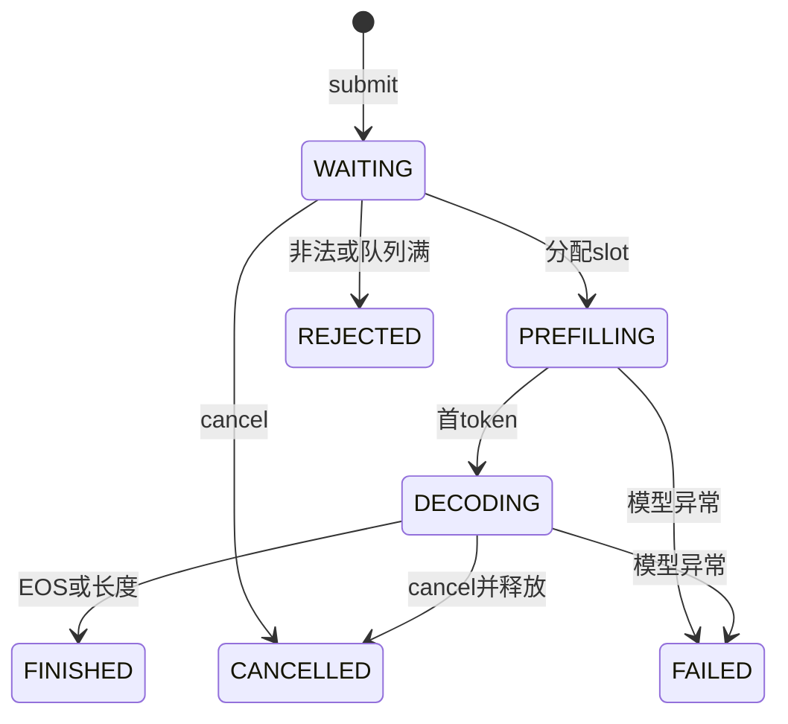

# v0.7：Continuous Batching、请求生命周期与多副本吞吐

## 1. 版本目标

v0.6 证明了 Qwen3-32B 可以通过 Tensor Parallel 在 Ascend 多卡上正确运行，也证明了单请求
从 TP=2 扩到 TP=4/8 并不会自然加速。v0.7 回答下一层问题：同样使用 8 个 logical devices，
应当选择一个 TP8 实例、两个 TP4 实例，还是四个 TP2 实例，才能获得更高的服务吞吐与
goodput。

本版本完整范围固定为 A/B/C/D 四个阶段：

| 阶段 | 内容 | 完成标志 |
|---|---|---|
| A | CPU/tiny 调度器与 fixed-slot KV allocator | 生命周期、动态 batch、清理路径测试通过 |
| B | Qwen3 与单个 TP replica | rank 0 决策、所有 TP ranks 一致执行与故障门禁通过 |
| C | 多副本、可重放 workload、服务指标、8 卡布局比较 | 软件测试、报告门禁和可复现命令齐全 |
| D | 真实 Ascend 验收 | TP8、2×TP4、4×TP2 同机正式证据通过 |

不属于 v0.7：HTTP API、Paged KV Cache、Prefix Cache、Speculative Decoding、量化、
CUDA Graph、算子融合。这些候选项仍在 v0.8 根据真实 profiler 结果选一个深入研究，长期路线
保持 `v0.7 → v0.8 → v0.9 → v1.0`。

## 2. 请求状态与资源所有权

每个请求只允许沿着明确的状态机前进：



`ServingRequest` 保存 request id、全局确定的 sequence id、prompt tokens、逐请求生成配置、
slot id、各阶段时间戳、生成 tokens 和终止原因。终态为 `FINISHED/CANCELLED/REJECTED/FAILED`；
任何终态都不能继续占有 KV slot。

`KVSlotAllocator` 使用固定 slot：

- 一个活跃请求独占一个 slot；
- slot 所有者与释放者必须匹配；
- EOS、达到最大输出长度、取消和模型异常都会释放；
- 释放同时清零 runner 中该 slot 的 cache length；
- 记录 allocation/release 数量、峰值 slot、有效 token 和内部浪费。

fixed-slot 的内部浪费为：

```text
已占用 slot 数 × max_seq_len - 当前所有活跃请求的有效 KV token 数
```

它不是 Paged KV Cache。v0.7 先把生命周期、正确性和可测性做实，内部碎片问题留给后续版本
依据实测价值决定是否进入专项研究。

## 3. 一个调度 step 怎样运行

`ContinuousBatchEngine.step()` 每轮严格执行：

1. 对当前 `DECODING` 请求组成动态 decode batch；
2. 每个请求只输入最新一个 token，读取原 slot 的历史 KV；
3. 处理 EOS/长度终止并立即释放 slot；
4. 使用本轮刚释放和原本空闲的 slot，从 waiting 队列录取请求；
5. 对新请求组成 prefill batch，写入对应 slot 并产生首 token；
6. 保存 batch size、请求 id、耗时、slot 和 KV token 统计。

先 decode、后 admission 的目的，是让本轮完成请求释放的 slot 可以在同一轮被新请求复用，
而不是空等下一轮。不同请求可以在不同 step 到达、完成和离开，因此 batch shape 会随时间变化。

## 4. TP ranks 为什么必须由 rank 0 控制

一个 TP replica 内所有 ranks 必须以相同顺序进入模型 collective。仅让每个 rank 根据自己的
Python 队列“碰巧做同样决定”不够可靠。

当前控制计划包含：

- phase：decode 或 prefill；
- sequence id；
- KV slot id；
- request prompt/config fingerprint；
- rank 0 看到的 waiting/running population。

rank 0 广播控制计划，各 rank 先在本地验证请求集合、状态、slot 和 fingerprint。任何 rank
发现差异后，所有 ranks 先完成同一个失败标志 AllReduce，再共同抛错；这样不会出现一个 rank
提前退出、其他 rank 卡在后续 HCCL collective 的假超时。

greedy/sample token 也只由 rank 0 选择后广播。sample 使用每请求独立 RNG，所以其他请求的
加入、退出和 batch 位置变化不会改变该请求的随机序列。

## 5. 单次 8 进程中的真实布局

三种布局都使用一个 `torchrun --nproc-per-node=8`：

| layout | TP subgroup | replica 数 | 每个 replica 的模型 |
|---|---:|---:|---|
| `tp8` | 8 | 1 | 一个 Qwen3-32B TP8 |
| `2xtp4` | 4 | 2 | 两个独立 Qwen3-32B TP4 |
| `4xtp2` | 2 | 4 | 四个独立 Qwen3-32B TP2 |

`TensorParallelReplicaContext` 为所有 ranks 按同一顺序创建子进程组。模型 AllReduce、
AllGather、token 广播和 scheduler 控制只发生在各自 TP subgroup；全局进程组只对齐每次
warmup/measured replay 的边界。

因此布局吞吐来自所有 replica 真实同时运行的最早开始到最晚完成墙钟区间，绝不使用：

```text
单个 replica 吞吐 × replica 数
```

这种乘法会忽略 HBM、内存带宽、PCIe/互联、CPU tokenizer、权重加载和运行时争用，不能作为
系统吞吐证据。

## 6. 多副本路由与可比性

通用 `MultiReplicaServing` 实现实时 least-loaded 路由。每次请求到达时读取各 replica 的：

- running requests；
- waiting requests；
- max slots；
- prompt 与剩余输出 token work。

优先最小化归一化 outstanding token work，再以队列和运行请求数打破平局，最后按稳定的
replica id 保证确定性。

正式多进程布局比较使用同一算法的确定性 projected-load assignment，在启动前把源 trace
分配给各独立 TP subgroup。这样三次重复拥有完全相同的请求归属，不把路由抖动混入 TP 布局
对比；报告保存完整 assignment 和 SHA-256。实时 router 的功能正确性由多个实际 engine 的
CPU/tiny 测试覆盖，正式硬件数字的准确表述是“确定性 least-projected-load 分配下的系统
吞吐”，不能包装成跨进程在线自适应路由收益。

## 7. Workload 与 replay

`WorkloadTrace` 是带内容哈希的 JSON，保存 request id、prompt、到达时间、deadline、生成参数、
seed 和 workload 元数据。加载时先核验请求语义 digest；真实布局报告还保存源 JSON 文件的完整
SHA-256，并在全部 global ranks 上精确比较，因此 workload 类型或元数据变化也不会漏检。
每个布局还会原样保存一份 `source_workload.json`，由 manifest 记录文件大小和 SHA-256；汇总时
重新解析它、重算请求语义 digest、重做确定性 least-projected-load 分片，并逐副本核对实际请求
集合与 partition digest，不能只靠报告自己声明“使用了某份 workload”。

三类预设：

| preset | 主要压力 |
|---|---|
| `short_short` | 高频短请求、调度开销与 decode batching |
| `long_prefill_short_decode` | 长 prompt Prefill、KV 写入和首 token |
| `mixed` | 长短请求共存、动态 batch 和尾延迟 |

两种 replay：

- `open_loop`：按 trace 的 `arrival_time_ms` 到达；系统过载时请求继续进入队列，可观察排队、
  rejection 和尾延迟。
- `closed_loop`：维持固定 client 数；一个请求终止后才补入下一个，适合稳定负载下比较系统
  饱和吞吐。

每个正式组合至少 1 次 warmup 和 3 次 measured repeat；保存每次原始请求、step、输出 digest、
wall time 和内存，禁止只保存平均值。

## 8. 指标口径

| 指标 | 定义 |
|---|---|
| request/s | 完成请求数 ÷ 布局真实并发墙钟时间 |
| input token/s | 完成请求实际编码输入 token 总数 ÷ 墙钟时间 |
| output token/s | 完成请求生成 token 总数 ÷ 墙钟时间 |
| goodput | 同时满足预先声明 TTFT、TPOT、E2E SLO 的完成请求数 ÷ 墙钟时间 |
| queue | submit 到取得 KV slot 的时间 |
| TTFT | submit 到首 token ready 的时间 |
| TPOT | 首 token 后相邻输出 token 的平均间隔 |
| E2E | submit 到请求进入终态的时间 |
| dynamic batch | 每个 step 的 active/decode/prefill batch size |
| KV | slot 峰值、有效 token、reserved token 和内部浪费 |
| HBM | 模型加载后与 measured run 的逐 rank 峰值 |
| utilization | measured run 时间区间内逐 logical device 的 AICore/内存/带宽采样 |

延迟输出 p50/p95/p99。goodput 只在运行前已经指定三个正数 SLO 时才具备正式证据资格；不能
看完结果后为某个布局量身修改阈值。

## 9. 遥测采集与证据门禁

Ascend 遥测默认使用官方训练/推理监测建议的 `npu-smi info -t common -i <id>`，从返回的
Chip ID block 中选择目标 chip；若当前产品明确支持指定 chip 的 usages 查询，也可使用
`--query-type usages` 调用 `npu-smi info -t usages -i <id> -c <chip_id>`。两条官方说明：

<https://www.hiascend.com/document/detail/zh/mindcluster/70rc1/faultdiag/faultdiagug/mindxdlFDUG024.html>
<https://www.hiascend.com/document/detail/zh/Atlas%20200I%20A2/260RC1/re/npu/npusmi_020.html>

采样器要求显式写出：

```text
logical_device_id=npu_id:chip_id
```

不要猜映射。先用当前机器支持的 `npu-smi info -l` 和 `npu-smi info -m` 核对 NPU ID、Chip ID，
再填写 `--target`。每个 measured run、每个 logical device 默认至少需要两条区间内采样；任何
采集错误、未正常结束、设备集合不完整或 AICore 字段缺失都会让报告降级为不完整证据。

## 10. 软件回归

安装项目依赖后执行：

```bash
python tests/test_continuous_batching.py
python tests/test_serving_workloads.py
python tests/test_qwen3_tp.py
python tests/test_tp_scaling.py
python -m compileall -q src tests benchmarks
git diff --check
```

允许本地 socket 的 Linux 环境额外执行：

```bash
MINIGPT_RUN_GLOO_TESTS=1 python tests/test_qwen3_tp.py
```

## 11. 生成正式 trace

以下示例固定 64 个请求和 seed 2026。正式验收前应先决定 request 数与 arrival rate，再生成并
冻结 trace；三个布局必须复用同一个文件，不能各自重新生成。

```bash
mkdir -p runs/v07/workloads

python benchmarks/generate_serving_workload.py \
  --preset short_short --request-count 64 \
  --arrival-interval-ms 50 --seed 2026 \
  --output runs/v07/workloads/short_short.json

python benchmarks/generate_serving_workload.py \
  --preset long_prefill_short_decode --request-count 64 \
  --arrival-interval-ms 50 --seed 2026 \
  --output runs/v07/workloads/long_prefill_short_decode.json

python benchmarks/generate_serving_workload.py \
  --preset mixed --request-count 64 \
  --arrival-interval-ms 50 --seed 2026 \
  --output runs/v07/workloads/mixed.json
```

## 12. 一个布局的真实 Ascend 运行模板

先在宿主机核对 mapping。假设核对后得到 4 张双芯卡、logical 0～7 对应 `0=0:0、1=0:1、
...、7=3:1`，采样器命令为：

```bash
mkdir -p runs/v07/mixed_closed_loop/tp8

telemetry_pid=""
cleanup_telemetry() {
  if test -n "$telemetry_pid" && kill -0 "$telemetry_pid" 2>/dev/null; then
    kill -INT "$telemetry_pid" || true
    wait "$telemetry_pid" || true
  fi
}
trap cleanup_telemetry EXIT

python benchmarks/sample_npu_telemetry.py \
  --target 0=0:0 --target 1=0:1 \
  --target 2=1:0 --target 3=1:1 \
  --target 4=2:0 --target 5=2:1 \
  --target 6=3:0 --target 7=3:1 \
  --interval-ms 200 \
  --output runs/v07/mixed_closed_loop/tp8/telemetry.json &
telemetry_pid=$!

# v0.6 实机已确认 --standalone 会受 hostname 解析影响；使用单机静态 rendezvous。
torchrun --nnodes=1 --nproc-per-node=8 \
  --master-addr=127.0.0.1 --master-port=29527 \
  benchmarks/infer_qwen3_continuous_batching.py \
  --model-dir /path/to/Qwen3-32B \
  --workload runs/v07/workloads/mixed.json \
  --mode closed_loop --closed-loop-clients 64 \
  --tp-size 8 --max-slots 32 --max-seq-len 4096 \
  --max-queue-size 128 \
  --ttft-slo-ms <预先冻结值> \
  --tpot-slo-ms <预先冻结值> \
  --e2e-slo-ms <预先冻结值> \
  --warmup 1 --repeats 3 \
  --device npu --backend hccl --precision bf16 \
  --chat-template --hash-weights \
  --layout-id tp8 \
  --logical-device-ids 0,1,2,3,4,5,6,7 \
  --physical-card-count 4 --chips-per-card 2 \
  --interconnect-topology "<机器真实拓扑>" \
  --cann-version "<环境快照中确认的CANN完整版本>" \
  --run-label mixed-closed-loop-tp8 \
  --output-dir runs/v07/mixed_closed_loop/tp8
benchmark_status=$?

kill -INT "$telemetry_pid"
wait "$telemetry_pid"
telemetry_status=$?
telemetry_pid=""
trap - EXIT

test "$benchmark_status" -eq 0
test "$telemetry_status" -eq 0
```

下面示例冻结全局 slot=32、全局 waiting queue=128；每副本容量随 replica 数等比例缩小，避免
把“副本越多时偷偷给更多全局并发容量”误算成布局收益。除表中参数外，其余参数保持不变：

| layout | `--tp-size` | `--max-slots` | `--max-queue-size` | `--layout-id` | 输出目录 |
|---|---:|---:|---:|---|---|
| TP8 | 8 | 32 | 128 | `tp8` | `.../tp8` |
| 2×TP4 | 4 | 16 | 64 | `2xtp4` | `.../2xtp4` |
| 4×TP2 | 2 | 8 | 32 | `4xtp2` | `.../4xtp2` |

三种布局都仍使用 `--nproc-per-node=8`，否则不是同一 8 devices 对比。

## 13. 汇总布局

每个布局会写 `replica-XX.json`、`source_workload.json`、`layout_provenance.json` 和带文件
哈希的 `layout_manifest.json`。优先从 manifest 加载，禁止手工漏掉某个 replica：

```bash
python benchmarks/summarize_serving_layouts.py \
  --manifest runs/v07/mixed_closed_loop/tp8/layout_manifest.json \
  --manifest runs/v07/mixed_closed_loop/2xtp4/layout_manifest.json \
  --manifest runs/v07/mixed_closed_loop/4xtp2/layout_manifest.json \
  --telemetry tp8=runs/v07/mixed_closed_loop/tp8/telemetry.json \
  --telemetry 2xtp4=runs/v07/mixed_closed_loop/2xtp4/telemetry.json \
  --telemetry 4xtp2=runs/v07/mixed_closed_loop/4xtp2/telemetry.json \
  --baseline-layout tp8 \
  --min-telemetry-samples-per-device-per-run 2 \
  --output runs/v07/mixed_closed_loop/layout_comparison.json
```

正式 `formal_qwen3_32b_tp8_vs_2xtp4_vs_4xtp2` 必须同时满足：

- 恰好 TP8、2×TP4、4×TP2；
- baseline 必须是 TP8；
- 每种布局都真实覆盖同一 8 logical devices；
- 三种布局使用同一 runner，且全局 slot 容量、全局 waiting queue 容量与 `max_seq_len` 相同；
- 同一 Python/PyTorch/torch_npu/CANN、hostname、设备型号、精度、HCCL 和物理拓扑；
- 同一 Qwen3-32B config、权重哈希、干净 Git commit；
- 同一源 workload、mode、global clients、SLO、warmup/repeats，以及相同的
  `open_loop_admission_scripted` 准入口径；
- 每个 manifest 的拓扑、原始 workload artifact、routing SHA-256、报告数量、文件大小和报告
  SHA-256 一致；
- routing assignment 自身哈希正确，能从原始 workload 确定性重算，并与每个 replica 的
  partition digest、每轮实际请求集合一致；
- 每轮 output SHA-256 能从请求终态、停止原因和完整 generated token IDs 重新计算；所有延迟
  必须是非负有限值，token 计数必须与 token IDs 长度一致，`slo_met` 必须能从逐请求延迟与
  预先冻结的 SLO 重算；
- replica 的正式候选资格由参数量、NPU/BF16/HCCL、软件版本、权重哈希、Git clean、测量次数
  和 SLO 等原始字段重新判定，不能只修改 `evidence_class` 字符串；
- 每个 repeat 的请求集合完整、无重复，时间区间有序且不重叠，replica 开始偏差不超限；
- 三个布局的 telemetry 映射一致、无错误、每卡每轮覆盖充足。

任何一项不满足，汇总仍保存实际数据，但 evidence class 自动降级并列出原因。

## 14. D 阶段验收矩阵与结论边界

完整 D 至少覆盖：

| workload | closed loop | open loop |
|---|---|---|
| short-short | 三布局正式吞吐/goodput | 三布局到达率/排队曲线 |
| long-prefill/short-decode | 三布局正式吞吐/goodput | 三布局 Prefill 排队/尾延迟 |
| mixed | 三布局正式吞吐/goodput | 三布局排队/拒绝/尾延迟 |

在正式运行前先做一次标为 exploratory 的校准，确定不会 OOM 的 `max_slots/max_seq_len`、
closed-loop clients、open-loop arrival interval 和 SLO；然后冻结这些值，重新运行完整矩阵。
探索数据不能与正式数据混合。

允许的结论：

- 哪种布局在指定 workload/SLO 下拥有最高 request/s、token/s 和 goodput；
- TP 减小、replica 增加后，HBM、AICore 利用率、动态 batch 和尾延迟怎样变化；
- v0.6 的“TP 主要解锁容量”怎样在 v0.7 转化为多副本系统吞吐。

禁止的结论：

- 用多副本系统吞吐宣称单请求 latency 加速；
- 把估算分片或 tiny CPU 数字称为 Qwen3-32B 实测；
- 没有 telemetry 时声称设备利用率提升；
- 只挑最快一次或在不同 workload、SLO、软件版本之间比较；
- 把确定性离线分配称为跨进程在线自适应 router。

六个 workload/mode comparison 都生成后，执行最终验收汇总：

```bash
python benchmarks/summarize_v07_acceptance.py \
  --comparison short_short/open_loop=<对应layout_comparison.json> \
  --comparison short_short/closed_loop=<对应layout_comparison.json> \
  --comparison long_prefill_short_decode/open_loop=<对应layout_comparison.json> \
  --comparison long_prefill_short_decode/closed_loop=<对应layout_comparison.json> \
  --comparison mixed/open_loop=<对应layout_comparison.json> \
  --comparison mixed/closed_loop=<对应layout_comparison.json> \
  --output runs/v07/v0.7_acceptance.json
```

最终汇总还会验证六份比较使用相同硬件/软件、Qwen3 config、权重哈希和 Git commit；同一种
workload 的 open/closed loop 必须复用同一个源 trace 和同一组 SLO。它还会按 comparison 中
记录的大小和 SHA-256 重新读取原始 workload、manifest、replica reports 与 telemetry，重新
生成整份三布局 comparison，再与待验收文件逐字段对照；不能通过修改 workload 标签或布尔
门禁伪造正式结果。汇总文件中的 artifact 引用使用相对路径，整体目录搬迁后仍可复核。完整
矩阵和完整证据链同时成立，才会标为
`formal_v0.7_qwen3_32b_ascend_continuous_batching_acceptance`。

只有 D 阶段真实机器证据、完整回归和冻结后自查全部通过，才能创建 v0.7 最终 tag。

## 15. Atlas A3 最终验收结果

2026-09-09 在 Atlas A3 上完成了 3 类 workload × open/closed loop × TP8、2×TP4、4×TP2
共 18 个正式布局运行。实机运行提交为
`0bad74ef01e083b8e23d388ed145a80dc81dc309`；Qwen3-32B BF16、17 份权重哈希、HCCL、
logical device 0–7、软件版本和冻结 SLO 均进入报告 provenance。

| workload | 模式 | TP8 goodput req/s | 2×TP4 | 4×TP2 | 最优布局 |
|---|---|---:|---:|---:|---|
| short-short | closed | 9.756 | **10.044** | 7.810 | 2×TP4 |
| short-short | open | 7.834 | **8.528** | 6.572 | 2×TP4 |
| long-prefill/short-decode | closed | 8.070 | 9.343 | **10.440** | 4×TP2 |
| long-prefill/short-decode | open | 5.360 | 4.269 | **6.055** | 4×TP2 |
| mixed | closed | 2.497 | 3.263 | **3.491** | 4×TP2 |
| mixed | open | 1.179 | 2.872 | **5.004** | 4×TP2 |

mixed open-loop 中 4×TP2 的 goodput 是 TP8 的 4.24 倍；mixed closed-loop 为 1.40 倍，
long-prefill closed-loop 为 1.29 倍。short-short 则由 2×TP4 小幅领先，说明最佳 TP/副本
组合取决于请求长度与到达模式，不能固定宣称“副本越多越快”。

正式 open-loop 使用 warmup 记录的 `(submit_count, action, wait_us)` admission script，在
measured repeats 中重放同一批组成，解决 NPU BF16 在不同 batch shape 下的近平局 token
漂移；各轮吞吐和延迟仍按真实墙钟测量。这个口径以
`protocol.open_loop_admission_scripted=true` 写入原始报告，并进入布局比较协议指纹。它是
确定性的离线 open-loop 准入重放，不等同于独立网络线程驱动的生产流量发生器。

完整压缩证据位于仓库根目录 `v0.7_ascend_evidence.tar.gz`，精选索引位于
`artifacts/v0.7_qwen3_continuous_batching_acceptance/`。压缩包解压后约 59 MB，核心
`SHA256SUMS` 143/143 通过；六份 comparison 均从原始 manifest、逐副本报告、workload 与
telemetry 独立重算为 formal，最终 acceptance 的 `complete_matrix=true` 且
`incomplete_reasons=[]`。
